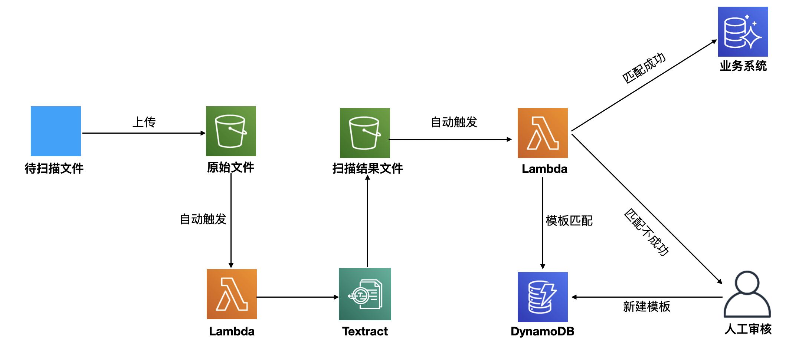
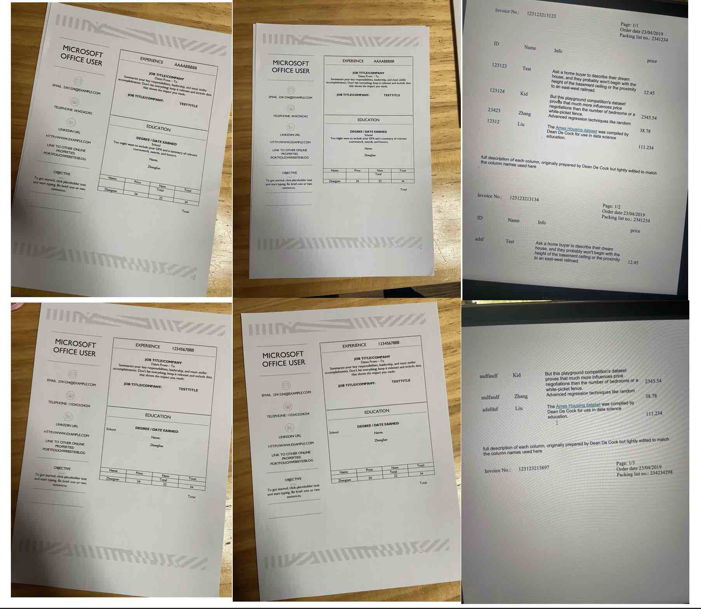
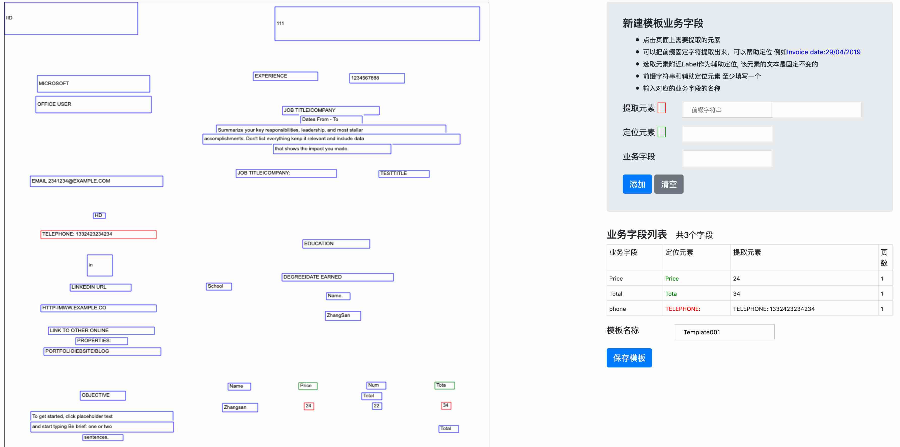
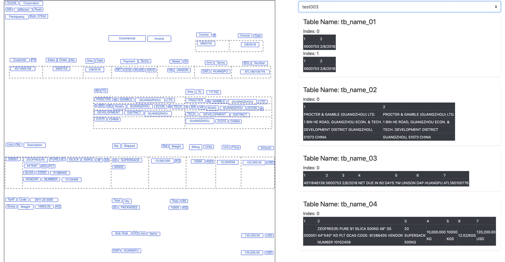
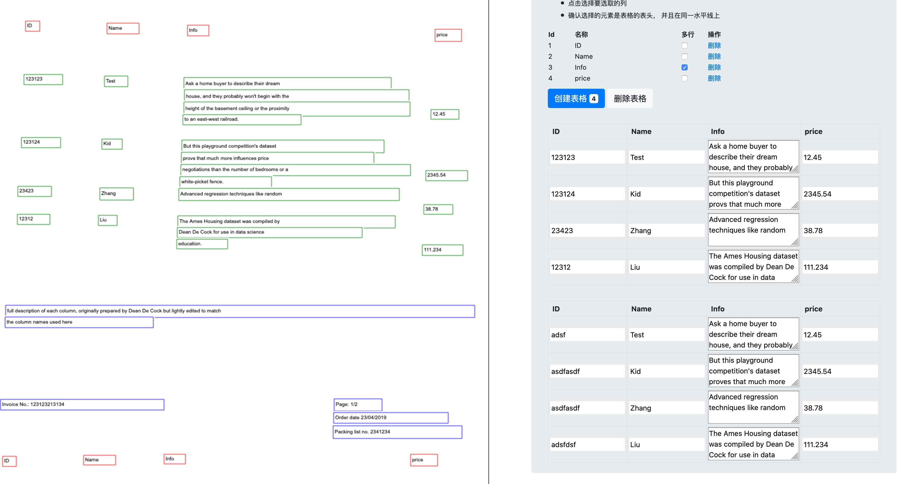
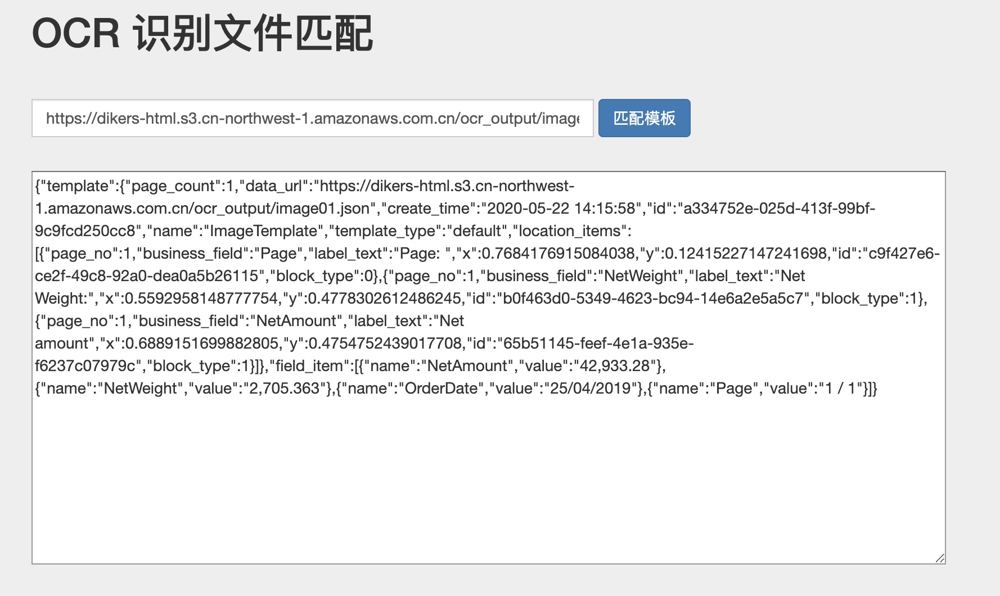

# 免责说明

建议测试过程中使用此方案，生产环境使用请自行考虑评估。
当您对方案需要进一步的沟通和反馈后，可以联系 nwcd_labs@nwcdcloud.cn 获得更进一步的支持。
欢迎联系参与方案共建和提交方案需求, 也欢迎在 github 项目issue中留言反馈bugs。

# 项目说明
通过AWS Textract 服务对图像中的文本进行识别， 返回json格式的数据文件， 然后通过UI界面对模板进行设置， 后续相同类型的图像文件，会自动进行识别。


#架构图 


# 识别的图像Demo



# UI截图

## 固定布局模板
模板的页数是固定的， 并且每个页面上的内容也是比较固定的，使用固定布局模板，适合单页或者多页固定格式的内容， 
例如发票，营业执照 身份证等固定内容的数据。




## 浮动布局模板
解决了连续分页问题， 一些表格内容长度不固定，而且会出现跨页的情况， 可以使用浮动布局模板进行解决。

 
### 横向表格如下：  


 
### 纵向表格如下：  



## DIY
根据自己业务的需求， 进行定制开发， 可以适用于更多的场景。 


# CDK 新建基础环境


## 执行CDK

操作步骤如下： 
```
cd cdk
cdk deploy
```
会自动生成一个Api-gateway + lambda + Dynamodb 服务的框架


## CDK 输出Api Gateway url地址

cdk 会在控制台输出如下url
https://xxxx.execute-api.cn-northwest-1.amazonaws.com.cn/prod/ocr

将这个地址替换以下三个js中的POST_URL地址， 用于给Lambda 发送消息
[./source/web/client/a.js](./source/web/client/a.js)
[./source/web/flow/index.js](./source/web/flow/index.js)
[./source/web/fix/index.js](./source/web/fix/index.js)

 
 
##  CDK参考文档 

[CDK 官方文档 ](https://docs.aws.amazon.com/cdk/latest/guide/home.html)
  
[CDK Workshop](https://cdkworkshop.com/)   


# 解析PDF JPG文件


## 调用脚本将pdf jpg生成json文件

调用AWS Textract 服务， 将PDF image里面的文本进行识别，以json格式返回结果，
保存到国内S3中，供后面应用调用。 

[请参考代码 source/text_ocr_util.py ](source/text_ocr_util.py)
 
```shell 

# 执行脚本

sh shell/text_ocr_util.sh

# 脚本内容说明， 使用前替换成自己的AWS账号的名称
python ./source/text_ocr_util.py \
--input_dir='./temp/' \                                 # pdf 或者jpg 文件路径
--output_dir='./target/' \                              # 生成json文件本地保存路径
--prefix_s3='ocr_ouput' \                               # S3 bucket 保存json文件的前缀
--global_s3_name='your_global_bucket_name' \            # Global bucket name 用于Textract 调用
--global_profile_name='your_global_profile_name' \      # Global profile name 用于Textract 调用
--cn_s3_name='your_cn_s3_name' \                        # 国内bucket name， 用于保存解析后的json文件
--cn_profile_name='your_cn_profile_name'                # 国内profile name 用于S3 调用 

```

* 建议用多个相同格式不同内容文件进行测试， 
第一文件用于生成模板， 剩余的文件进行测试


## TODO  代码封装到Lambda中， 用网页进行文件调用


# 部署web 页面

./web 目录下的文件可以部署到服务器上， 或者在本地打开， 进行操作。 

```
source/web/fix/index.html        固定布局的模板设置
source/web/flow/index.html       连续布局的模板设置
```

## 生成固定布局的模板

在浏览器中打开[./source/web/fix/index.html](./source/web/fix/index.html)
在界面中填入一个解析后的json地址
选择定位的元素， 生成模板， 然后换一个相同格式的pdf的json 调用下面的测试代码进行匹配


## 固定模板测试

source/web/client/index.html     客户端进行固定模板匹配的示例



