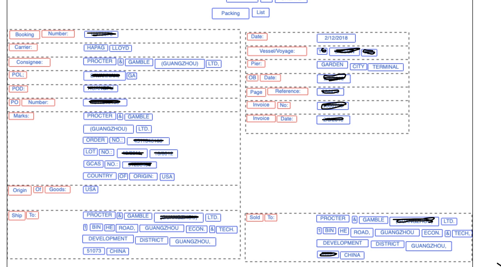

# 免责说明

建议测试过程中使用此方案，生产环境使用请自行考虑评估。
当您对方案需要进一步的沟通和反馈后，可以联系 nwcd_labs@nwcdcloud.cn 获得更进一步的支持。
欢迎联系参与方案共建和提交方案需求, 也欢迎在 github 项目issue中留言反馈bugs。

# 项目说明
通过AWS Textract 服务对图像中的文本进行识别， 返回json格式的数据文件， 然后通过UI界面对模板进行设置， 后续相同类型的图像文件，会自动进行识别。


#架构图 


# 识别的图像Demo


# UI截图

### 固定布局模板
模板的页数是固定的， 并且每个页面上的内容也是比较固定的，使用固定布局模板，适合单页或者多页固定格式的内容， 
例如发票，营业执照 身份证等固定内容的数据。


### 浮动布局模板
解决了连续分页问题， 一些表格内容长度不固定，而且会出现跨页的情况， 可以使用浮动布局模板进行解决。
 



### DIY
根据自己业务的需求， 进行定制开发， 可以适用于更多的场景。 


# CDK 新建基础环境

会自动生成一个Api-gateway + lambda + Dynamodb 的服务框架

操作步骤如下： 

```
cd cdk
cdk deploy
```


# PDF/Image 生成json   

调用AWS Textract 服务， 将PDF image 里面的文本进行识别，以json格式返回结果。 
 [请参考代码  ./src/text_ocr_util.py ](./src/text_ocr_util.py)
 
如果第一次使用CDK ，请先阅读以下两个文档. 

[CDK 官方文档 ](https://docs.aws.amazon.com/cdk/latest/guide/home.html)
  
[CDK Workshop](https://cdkworkshop.com/)   


# 部署web 页面

cdk 会输出Api gateway 的访问地址， 替换掉./web/fix/index.js里面的 api 地址。 

./web 目录下的文件可以部署到服务器上， 或者在本地打开， 进行操作。 

```
./web/fix/index.html        固定布局的模板设置
./web/flow/index.html       连续布局的模板设置
./web/client/index.html     客户端进行匹配的示例
```


# 调用baiduOCR 自动生成训练样本


[百度OCR api 接口](https://ai.baidu.com/ai-doc/OCR/)


申请 开发ID 和Key
```python
from aip import AipOcr

""" 你的 APPID AK SK """
APP_ID = '你的 App ID'
API_KEY = '你的 Api Key'
SECRET_KEY = '你的 Secret Key'

client = AipOcr(APP_ID, API_KEY, SECRET_KEY)
```


### 修改run.sh 脚本

```shell script

export PYTHONPATH=../

python ../baidu_ocr/baidu_ocr.py \
--input_dir='../temp/' \
--output_dir='../target/' \
--app_id='app_id' \
--api_key='api_key' \
--secret_key='secret_key'
```


### 生成数据示例样本
```

.
├── test001_pdf_a98aac73    第一个PDF
│   ├── data.json           ocr 返回结果
│   ├── image.png           样本图片
│   ├── images              裁剪后的小图
│   └── labels.txt          标记文本数据
└── test002_pdf_6df2f695
    ├── data.json
    ├── image.png
    ├── images
    └── labels.txt

```
